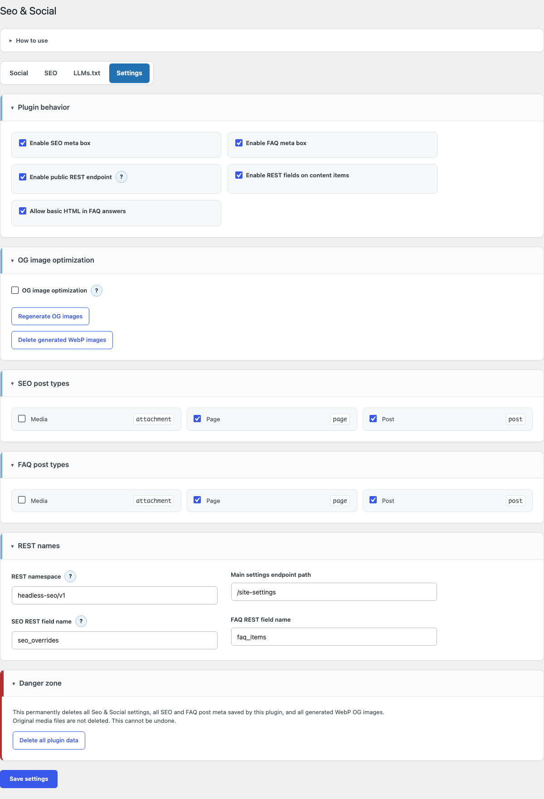
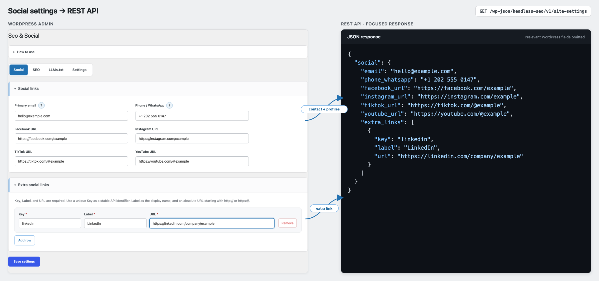
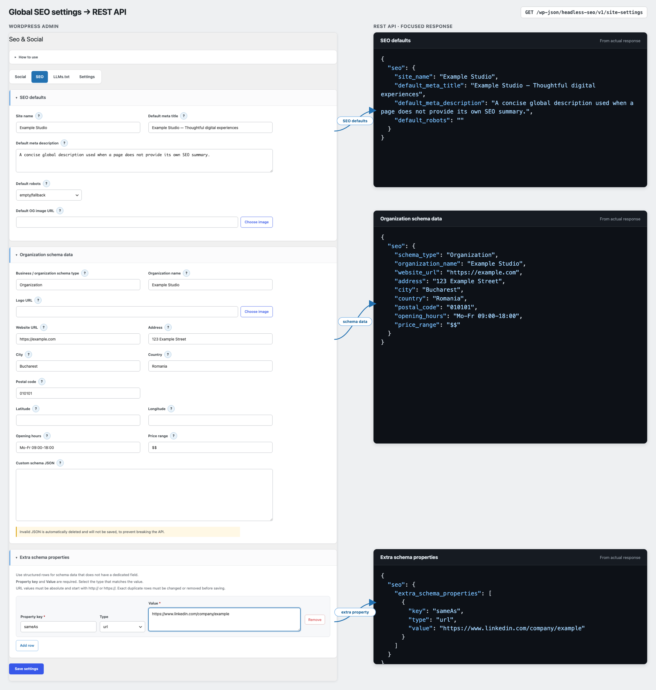
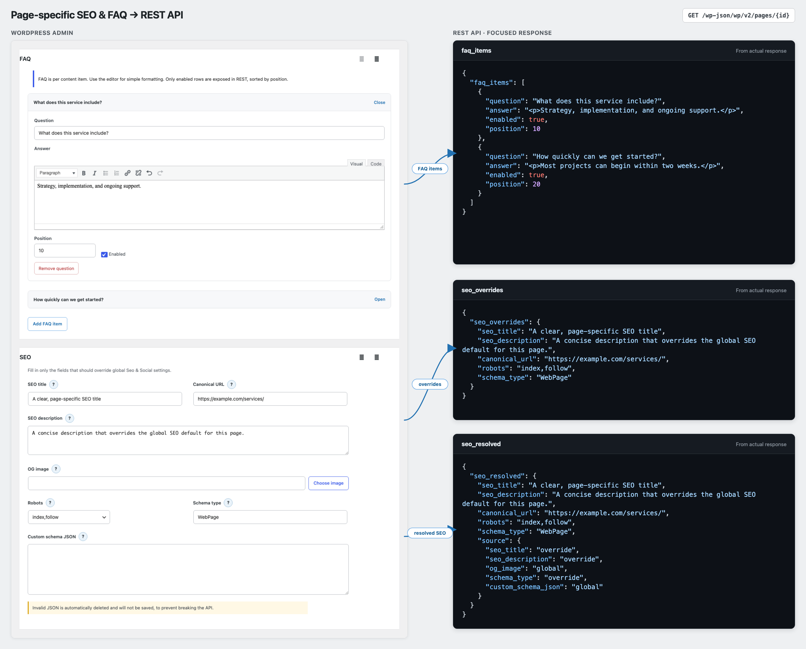

# Seo & Social

Seo & Social is a headless WordPress plugin that turns WordPress into a small SEO, social, schema, FAQ, and LLMs.txt content source for modern frontends.

It is built for projects where WordPress manages editorial data, but the public website is rendered by a frontend such as Next.js, Astro, Nuxt, Remix, or a custom React app. The plugin exposes structured REST API data only. It does not render frontend meta tags, Open Graph tags, JSON-LD, FAQ UI, sitemap files, or `/llms.txt` directly.

## Project Purpose

This repository is meant to be both a usable WordPress plugin and a portfolio-quality example of a production-minded headless CMS integration.

The implementation focuses on:

- Clear separation between CMS data ownership and frontend rendering.
- A stable REST contract for SEO and social metadata.
- Safe admin workflows for global settings, per-content overrides, FAQ data, and LLMs.txt source content.
- Conservative security defaults for public endpoints, role access, data deletion, and generated media.
- A clean plugin ZIP build that excludes repository-only documentation and development files.
- A layered QA workflow covering PHPUnit integration, Playwright admin E2E, package verification, compatibility checks, and documented manual testing.

## Seo & Social Plugin Walkthrough
> **Note:** This walkthrough was recorded with an earlier version of the admin interface. The plugin workflow and core functionality remain the same; see the screenshots below for the current UI.

[Watch the plugin walkthrough](https://github.com/user-attachments/assets/0b1adc56-9d54-4366-b7a4-8fd6f281fb83).

## Screenshots

### General Settings



### Social Settings



### Global SEO Settings



### Page-Specific SEO & FAQ



## What The Plugin Does

- Stores global social/contact links.
- Stores global SEO defaults.
- Stores organization/schema data.
- Stores a default robots value, empty by default.
- Adds optional 1200x630 WebP OG image generation while keeping original media untouched.
- Adds per-content SEO override meta boxes for enabled post types.
- Adds per-content FAQ meta boxes for enabled post types.
- Exposes global data through a configurable REST endpoint.
- Exposes per-content `seo_overrides`, `seo_resolved`, and `faq_items` fields.
- Exposes LLMs.txt source content as JSON, including a ready-to-serve `rendered_txt` string.
- Provides manual admin actions for regenerating OG images, deleting generated WebP images, and deleting all plugin data.
- Leaves saved data intact on uninstall by design.

## Architecture

The plugin is intentionally headless:

- WordPress stores content and settings.
- WordPress exposes structured REST data.
- The frontend decides how to render metadata, Open Graph tags, JSON-LD, FAQ UI, sitemap files, and `/llms.txt`.

Global settings are stored in one WordPress option array. Per-content SEO and FAQ values are stored as post meta. Generated OG WebP files are derived files in uploads and are tied back to the selected source attachment.

### Supported Post Types

Public post types continue to be supported as before. The SEO and FAQ post-type settings also offer custom post types registered for headless use with `public => false`, `show_ui => true`, and `show_in_rest => true`.

Eligible headless post types are opt-in and are not enabled automatically. Once enabled, the existing SEO and FAQ meta boxes and `seo_overrides`, `seo_resolved`, and `faq_items` REST fields work normally. Seo & Social only discovers these post types; it does not change their visibility or any WordPress registration properties.

## Access Model

Administrators can access the global Seo & Social admin pages by default.

Editors do not see the global plugin menu by default. They can still use SEO and FAQ meta boxes on content they are already allowed to edit, when those post types are enabled in plugin settings.

Custom projects can extend global plugin access through trusted developer filters, but the public default is Administrator-only.

## REST API

Default global settings endpoint:

```text
/wp-json/headless-seo/v1/site-settings
```

Default LLMs.txt JSON endpoint:

```text
/wp-json/headless-seo/v1/llms
```

Default per-content REST fields:

```text
seo_overrides
seo_resolved
faq_items
```

`seo_overrides` contains only the values saved on the current page, post, or CPT item.

`seo_resolved` contains the final SEO payload after local overrides are merged over global defaults. Frontends should usually render metadata from `seo_resolved`.

`faq_items` contains enabled FAQ rows for that content item.

The global endpoint namespace/path and the `seo_overrides` / `faq_items` field names can be changed from Settings. `seo_resolved` is reserved and always keeps that name.

## Frontend Usage

A typical frontend integration:

1. Fetch global settings from `/wp-json/headless-seo/v1/site-settings`.
2. Fetch the page, post, or CPT item from the WordPress REST API.
3. Use `seo_resolved` to render title, description, canonical URL, robots, OG image, and schema-related page data.
4. Use `faq_items` to render FAQ UI and optional FAQPage JSON-LD.
5. Use global social and organization data for layout, footer links, contact blocks, and Organization JSON-LD.
6. Use `/wp-json/headless-seo/v1/llms` to build and serve the frontend-owned `/llms.txt`.
7. Generate sitemap files in the frontend, because the frontend owns the final public URL structure.

See the [frontend integration recommendations](frontend-usage-recommendations.md) for a more detailed implementation guide.

## Local Development

Install dependencies only when needed:

```bash
composer install
```

Run PHP syntax checks:

```bash
npm run syntax:php
```

Run all local validation checks:

```bash
npm run validate
```

Run WordPress Coding Standards when Composer dependencies are installed:

```bash
composer lint:php
```

Build the upload ZIP:

```bash
npm run build:zip
```

The ZIP is created at:

```text
dist/seo-and-social.zip
```

The upload ZIP contains only the runtime `seo-and-social/` plugin files. Repository docs, scripts, generated manifests, local workflow files, `.git`, `vendor/`, and `dist/` are excluded.

For the complete local environments, automated suites, package checks, and release gates, see the [development and testing guide](docs/development/testing.md). The [QA strategy](docs/qa/test-strategy.md), [manual scenarios](docs/qa/manual-scenarios.md), and [baseline report](docs/qa/reports/test-foundation-baseline.md) document the manual test process and evidence.

## WordPress Installation

1. Build `seo-and-social.zip`, or download it from [GitHub Releases](https://github.com/MCaius/seo-and-social-wordpress-plugin/releases).
2. In WordPress, go to `Plugins -> Add New Plugin -> Upload Plugin`.
3. Upload and activate `Seo & Social`.
4. Open `Seo & Social` in wp-admin as an Administrator.
5. Configure Settings first, then fill Social, SEO, and LLMs.txt fields.
6. Edit pages/posts/CPT items to add local SEO overrides or FAQ rows.

The first version that includes the GitHub updater must be installed manually on existing sites. After that, newer stable GitHub Releases that contain the verified `seo-and-social.zip` asset appear in the standard WordPress Plugins and Updates screens. Drafts, prereleases, missing assets, and packages outside the allow-listed repository are ignored.

## Security Notes

- Global plugin pages are Administrator-only by default.
- Public settings output can be disabled from Settings.
- Public plugin endpoints use a lightweight unauthenticated rate limit.
- Proxy IP headers are ignored unless enabled through trusted developer filters.
- Settings and meta saves use WordPress nonces and capability checks.
- Custom JSON fields must validate before they are exposed in API output.
- Generated WebP deletion is restricted to plugin-generated files in the uploads directory.
- Uninstall is intentionally non-destructive; data deletion is a manual Administrator action.

See [SECURITY.md](SECURITY.md) for the full policy.

## Forking Or Adapting

Good places to customize:

- Plugin labels and text domain.
- Default REST namespace and endpoint path.
- Allowed access roles through filters.
- Frontend field mapping in your application.
- Schema property presets and validation rules.
- CI/release workflow details for your own publishing process.

Avoid changing the public REST shape casually once a frontend depends on it. If a breaking change is needed, prefer adding a new field or endpoint version first.

## License

Seo & Social is licensed under GPL-2.0-or-later. See [LICENSE](LICENSE).
